# RootSegmenter

A human-in-the-loop annotation tool for image segmentation, built around active learning. A labeler corrects the program's output, the corrections train a neural network, and the network becomes the starting point for the next image. Twelve labeled images were enough to cut labeling time by more than half and raise label quality from roughly .93 Dice to roughly .98. The two best existing tools in the field score between .45 and .74 on the same datasets.

The underlying problem is the one every annotation pipeline has. Good labels are expensive because they require a human, and the human is the bottleneck. The usual response is to accept worse labels in order to get more of them. This program holds label quality fixed and attacks the human's time instead.

The domain is root phenotyping, the measurement of a root's physical characteristics. It is a bottleneck in agricultural science, because the purpose of root phenotyping is to test the results of scientific experiments. If the labels are inaccurate, the results of the experiment will also be inaccurate. Therefore, the only useful phenotyping software is one that does not make significant mistakes. That constraint is what makes it a demanding test case, because there is no room to trade quality for throughput.

Accuracy is a requirement rather than a preference, but treating it that way does not mean accepting whatever speed happens to result. The secondary goal is minimizing user time, which is anything in the labeling process that requires human attention. This includes the time it takes to produce the labels, the time it takes to verify them, and the time it takes to test and optimize the software on a particular dataset. The amount of computer time is not significant, because computers are significantly faster, cheaper, more scalable, and can work around the clock.

The program holds accuracy fixed and attacks user time from four directions. It provides good defaults so the common case is fast. It provides a small set of tools that do not overlap, so there is little to learn and little to choose between. It saves settings and texture examples per dataset, so granular control is configured once instead of once per image. Finally, it uses a neural network that improves its own starting point as labels accumulate. The result is a program that requires accuracy and still finishes quickly.

This was my MS Computer Science project at Cal Poly Pomona in 2024. The full write-up, including the literature survey and the evaluation methodology, is in [docs/paper.pdf](docs/paper.pdf).

## Why the ground truth had to be rebuilt

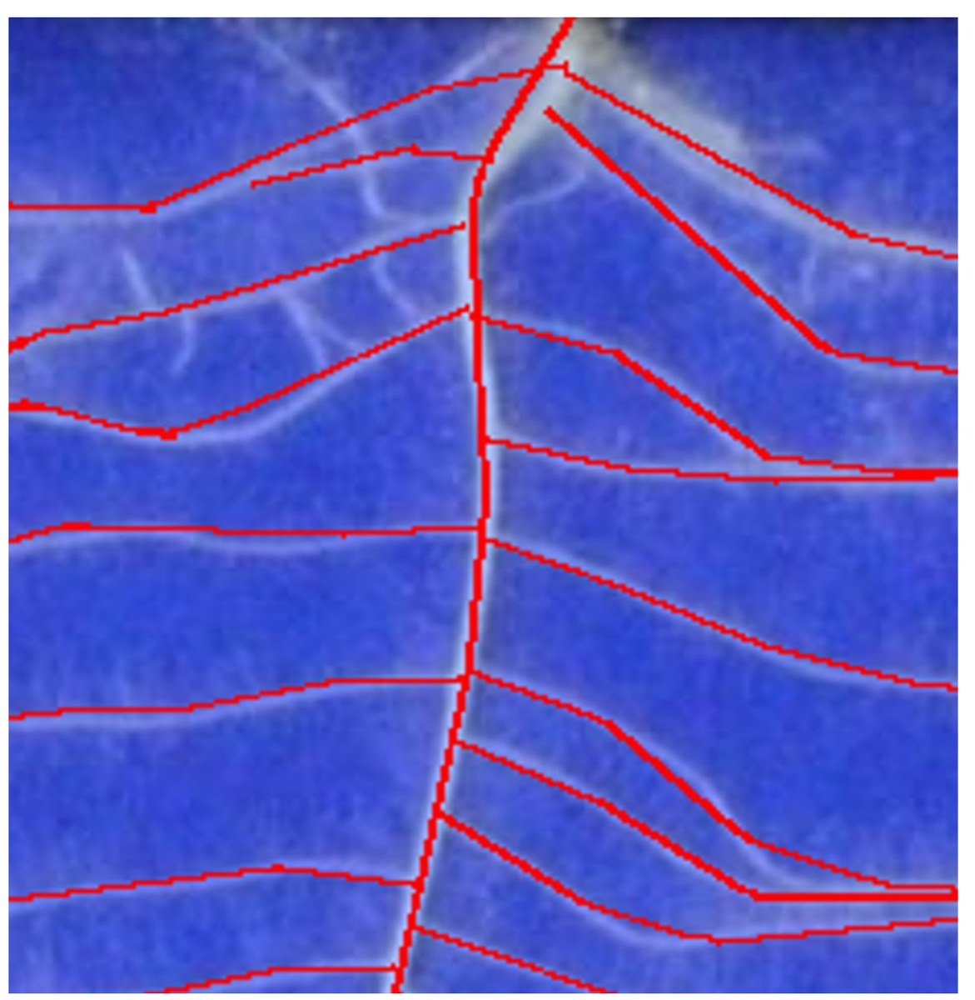

These are the labels that ship with the public rapeseed dataset, produced by domain experts using the existing tooling. Note the unlabeled offshoots and how the labels lose track of the roots when they curve. The Arabidopsis set has the same problem in a milder form.

Labels like these cannot serve as a ground truth, so new ones had to be produced for all three datasets before anything could be measured. That is also the argument for the project in one image. If the best available tools produce this, the tools are the problem.

Adapted from the [GigaDB supporting data](https://doi.org/10.5524/100651) for RootNav 2.0.

## Results

Every column is driven by a human labeler except the two marked Auto, which show this project's network running with no human input at all. Neural Net 6 and Neural Net 12 mean the network was trained on that many labeled images.

Average Dice coefficient, where higher is better:

| Dataset | RootNav | saRIA | Project | Neural Net 6 | Neural Net 12 | Neural Net 6 Auto | Neural Net 12 Auto |
|---|---|---|---|---|---|---|---|
| Main | N/A | .6584 | .9313 | N/A | .9769 | N/A | .9702 |
| Arabidopsis | .6619 | .7350 | .9420 | .9721 | .9893 | .9548 | .9829 |
| Rapeseed | .6279 | .4539 | .9272 | .9529 | .9826 | .9407 | .9780 |

Average seconds to label one image, where lower is better:

| Dataset | RootNav | saRIA | Project | Neural Net 6 | Neural Net 12 |
|---|---|---|---|---|---|
| Main | N/A | 199 | 865 | N/A | 403 |
| Arabidopsis | 379 | 164 | 245 | 148 | 108 |
| Rapeseed | 487 | 106 | 510 | 197 | 145 |

RootNav did not receive a score on the main dataset. It was so overwhelmed by the dataset's complexity that it would have likely taken at least an hour to label a single image, and would still have had poor accuracy.

Four results are worth drawing out. The first is that the accuracy gap is large. The difference between .93 and the .45 to .74 range is the difference between labels that can be published and labels that have to be discarded. The existing ground truths for both public datasets had to be thrown out for that exact reason.

The second is that the network paid for itself after twelve labeled images. It cut labeling time by a factor of two to three and a half, and raised accuracy at the same time. It was trained for two hours on a single V100.

The third is that the network on its own, with no human involvement, beat every existing semi-automated tool by roughly .25 Dice.

The fourth is that label quality rises monotonically with the number of labeled images, from .9420 to .9721 to .9893 on Arabidopsis and from .9272 to .9529 to .9826 on rapeseed. That is the active learning loop working as intended. Every image the labeler corrects makes the next one cheaper, and the curve has not flattened by twelve.

Consistency is also worth noting. RootSegmenter scores within .015 Dice across three visually very different datasets, while saRIA ranges from .4539 to .7350. A software is adaptable if it can consistently perform well on datasets it was not trained or optimized on. If the software is not consistent, taking the time to use it on a new dataset is inherently risky.

### Caveats

There were no quality ground truths for any of the datasets, so new ones had to be produced. This was done using this program with its most trained network, spending much more time than normal manually ensuring everything was correct. A significant portion of the network's predictions were kept in the ground truths, so it is likely the neural networks obtained a higher score than they should have.

That bias touches exactly one comparison, which is the internal gap between the .93 column and the .98 columns. It cannot account for the gap against saRIA and RootNav, because those were scored against the same ground truth without contributing anything to it. It also runs against the project's own non-network scores, which were hurt by the same process, so even the internal comparison is more balanced than it first appears.

RootNav also has lower scores than it probably should. Its labels are just slightly off, meaning it has the spirit of the roots but not the exact values. It did still make some significant errors, such as missing some offshoots completely.

## Why it performs better

The advantage does not come from a better core algorithm. It comes from how much the user can tell the program, and how cheaply they can tell it.

There are a huge number of variables between root datasets, including plant species, image resolution, background color and brightness, number of plants and their proximity, occluding objects, and more. These variations cannot be accounted for by a few controls. The user needs to be able to provide much more information to achieve high accuracy, and this program facilitates that, while also allowing them to ignore ineffective stages to preserve speed.

Each stage is meant to function independently and can be turned on or off as needed. A stage that does not help on a given dataset costs nothing except the decision to skip it. Every panel's settings and the texture matcher's examples are saved and reloaded per dataset, so the first image of a dataset takes somewhat longer, but the cost becomes small when averaged over the entire dataset.

The program also has full undo and redo, which applies to every state change. Neither RootNav nor saRIA has any form of undo or redo, so if the user makes a mistake, they must either live with it or start from scratch. They also make it difficult to see the program's state and the underlying root image at the same time. RootNav can toggle the image and its predictions, but it is hidden away in a menu. saRIA cannot remove its labels at all, does not allow the user to zoom, and always shows color images in grayscale.

These issues sound cosmetic, but they are not. They drag the user down and cause them to make and not fix mistakes. They also wear the user out, which causes them to get tired and make even more mistakes. Good usability is an accuracy feature rather than a convenience.

## How it works

The program works in nine stages. The user steps through them, adjusting settings and watching the labels update, and can return to any previous stage using undo.

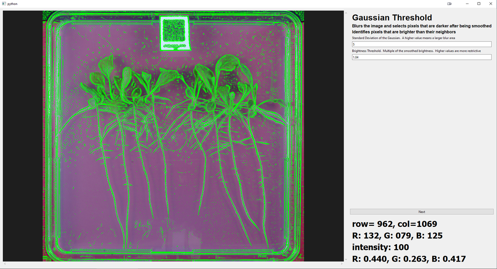

| # | Stage | Implementation |
|---|---|---|
| 0 | Neural network. Predicts an initial mask, then post-processes it with the connection and pruning stages. | [Controller.py](Controller.py), [TrainNetwork.py](TrainNetwork.py) |
| 1 | Gaussian filter. Selects pixels that are brighter than their neighbors. | [GaussianThreshold.py](GaussianThreshold.py) |
| 2 | Label cropping. The user draws a polygon to discard everything outside the growth area. | [Controller.py](Controller.py) |
| 3 | Edge finder. Removes root fuzz by locating the true edges of each root. | [EdgeFinder.py](EdgeFinder.py) |
| 4 | Texture matcher. Classifies patches with an SVM trained on user-provided examples. | [TextureMatcher.py](TextureMatcher.py) |
| 5 | Fill small holes. Fills gaps whose brightness matches their border. | [FillSmallHoles.py](FillSmallHoles.py) |
| 6 | Connect separated roots. Rejoins roots broken by brighter crossing roots. | [ConnectRoots.py](ConnectRoots.py) |
| 7 | Remove small objects. Prunes debris. | [Controller.py](Controller.py) |
| 8 | Manual correction. Three skeleton-aware editing tools. | [HumanCorrection.py](HumanCorrection.py) |

The output is a binary segmentation mask. For each pixel, the mask is True if it represents a root and False otherwise. This approach is simple, still provides a large amount of detail, and is compatible with many image processing algorithms.

### Edge finder

Roots often have small offshoots called hairs that can spread to be far larger than the actual root. Root hairs are brighter than the background, so the Gaussian filter stage tends to select them along with the root's real body, which hurts the overall results. This stage finds the transition between the root's body and the background using relative pixel brightnesses.

The algorithm runs on each candidate pixel. Starting at the candidate, it sends out eight probes in all directions. Each probe steps in its initial direction as well as its relative right and left, and cannot move right or left twice in a row. This forces the probes to move in their initial direction while providing some leeway for different paths and root curvature.

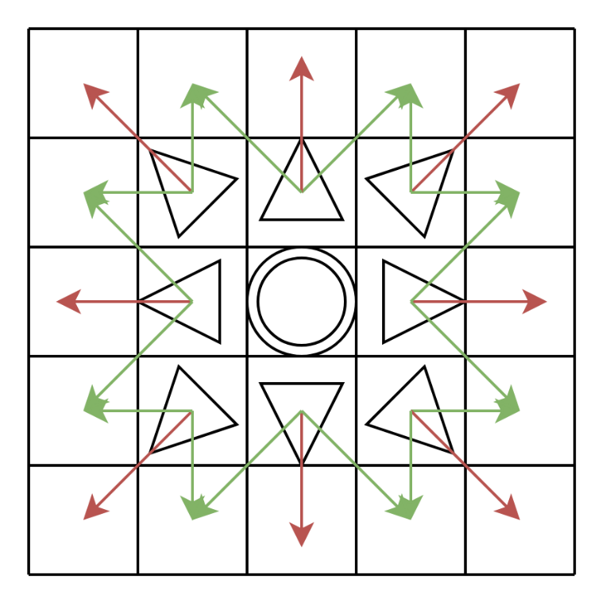

At each step the brightness at every probe's position is checked against a threshold. If the brightness is less than the threshold, the pixel is considered an edge and removed from the list of candidates. The threshold starts as a multiple of the candidate's brightness, and is updated each step to be a multiple of the darkest pixel encountered so far. The darkest pixel is the best representation of a true edge and makes false edges significantly less likely. It also makes the algorithm more likely to miss valid edges, but there are multiple chances to find each edge since the function is run multiple times.

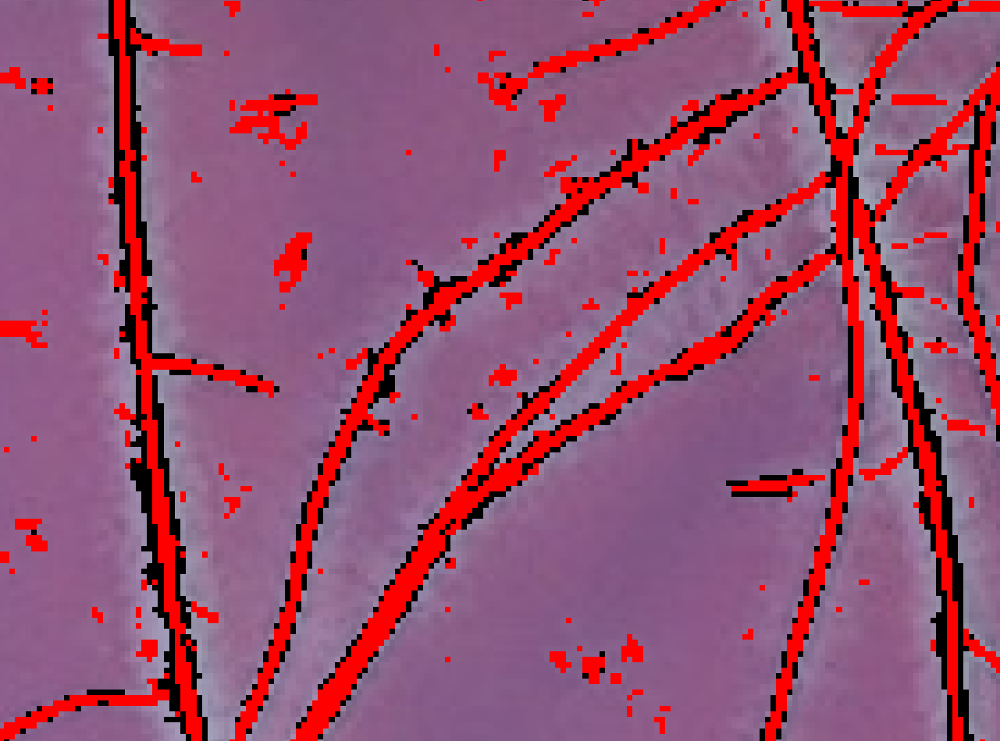

Roots are shown in red, and removed labels in black.

### Texture matcher

This stage removes obvious background using simple color information. It creates an 11x11 pixel texture image centered on each candidate pixel, generates features from it, and uses a support vector machine to determine whether the pixel is background or foreground. The user provides the training examples by right and left clicking on foreground and background.

The features come from a 3D color histogram computed in the LAB color space rather than RGB. Unlike RGB, the LAB space is designed so that if two positions are near each other, they are also perceptually similar. This makes the histogram more effective, since the values binned together have similar appearances. L is given 8 bins, and A and B are given 16 bins each over a range of [58, 203), since the A and B space is not fully used. The resulting 2048 normalized bins are given to the SVM as features.

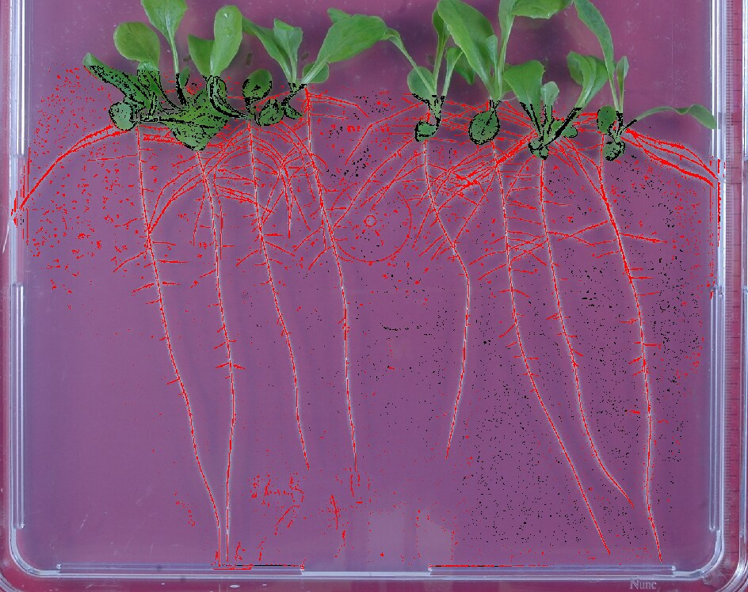

Pixels removed as background are shown in black.

The examples are saved and loaded for future images from the same dataset, so the few minutes spent providing them is spread across the whole dataset. This stage is not intended to work in complex or nuanced situations. If the image is grayscale or the matcher is otherwise ineffective, it should simply not be used.

### Connect separated roots

The Gaussian filter and edge detection stages both tend to drop pixels where a bright root intersects a darker one. The Gaussian filter compares pixels to the local brightness, so a dark root can be overwhelmed by a bright one in close proximity. The edge detector may correctly find the edges of the bright root, but those edges coincide with the darker root. Both issues disconnect root labels, which has a very negative impact on the manual correction stage.

Roots tend to travel in straight lines and only make gradual curves, so structural information can repair the damage. The program first skeletonizes the labels, which removes unnecessary detail and makes a root's general direction easier to determine. It then finds root ends by convolving the labels with a 3x3 kernel of ones with a ten in the middle. A skeleton endpoint has exactly one neighbor, so a convolved value of exactly eleven identifies one. For each endpoint the algorithm walks back along the straight portion of the skeleton to establish a heading, then searches along that heading for a root of similar brightness to connect to. The stage repeats until the labels stop changing.

| Before | After |
|---|---|
| 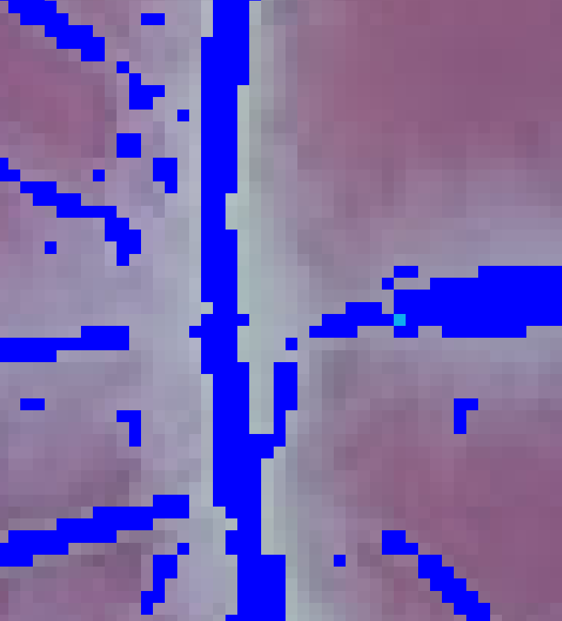 | 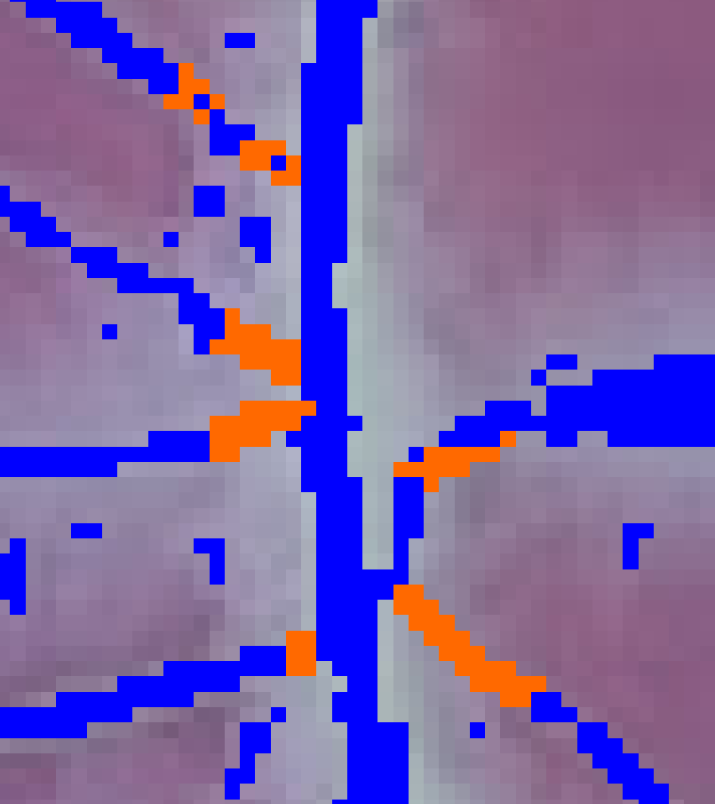 |

Newly connected pixels are shown in orange.

### Manual correction

This stage is the main focus of the program, since it is the only one that can achieve human level accuracy. The previous stages are only meant to quickly provide the user with a good starting point. It provides three tools.

**Delete in radius.** Middle clicking deletes labels within a radius, which can be enlarged with modifier keys. This is useful for removing incorrect labels in areas with minimal actual roots, and for smoothing a root's edges by repeatedly deleting along the edge.

**Delete segment.** Right clicking identifies the segment a pixel belongs to and removes it. A segment is a portion of the skeleton that does not contain any branches, and it includes all labels that are closer to that segment than to any other skeleton.

Finding the nearest skeleton is not as simple as returning the first one encountered, because the neighbors are 8-connected. The search instead records the minimum distance to reach each visited skeleton and keeps searching until the search depth exceeds the closest one found. Once the nearest skeleton pixel is known, the program traverses adjacent pixels until it reaches a branch or an endpoint, which gives the selected segment. It then repeats the nearest skeleton search for all labels and removes any that are closest to that segment.

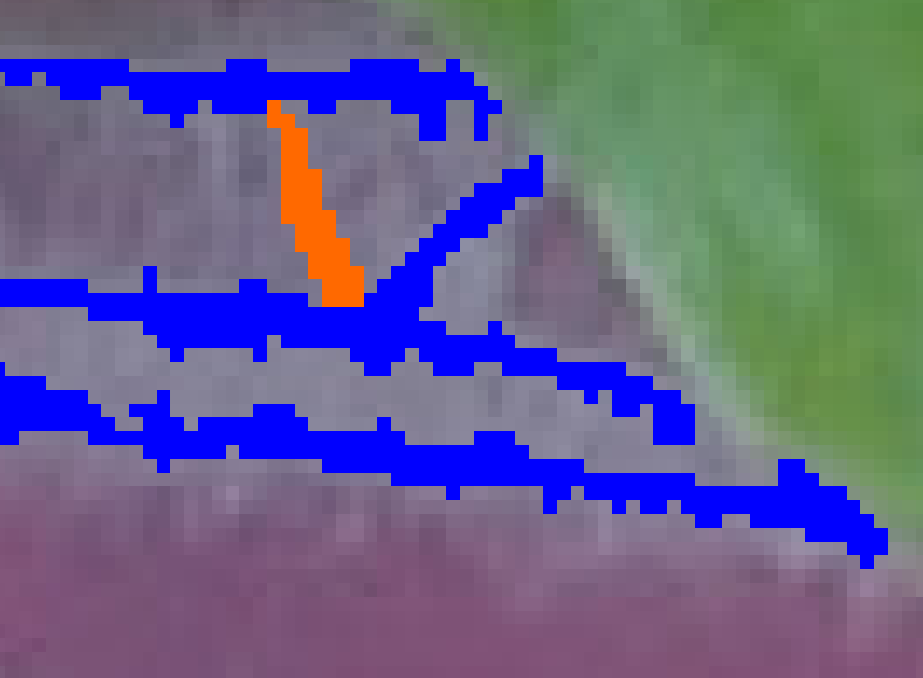

An erroneous bridge between two valid roots, removed with a single right click. Deleted labels are shown in orange.

This tool works well together with the connection stage, because most mistakes that stage makes can be removed without taking any extra time. That is what makes an aggressive automatic connection worthwhile, since each of its errors costs one click.

**Add segment.** The user marks the start position by left clicking and the end position with another left click. The algorithm finds the best path between them, and can track a root's curve and its thickness. This is the tool that makes dense, overlapping root systems practical to label.

The algorithm uses probes to find the best path, but they behave differently from the ones used by the edge finder. Those probes were intended to curve slightly while remaining largely fixed in direction. These probes change their direction based on their recent moves. If a probe repeatedly makes turns, its direction is updated to the turned direction, which allows it to turn further in that direction. This forces the probes to travel in the same general direction while still being able to track a curving root.

The algorithm uses fast and slow probes at the same time. Fast probes can turn in the same direction multiple times in a row, and slow probes cannot, which gives the fast probes a smaller turning radius. The two fail in opposite situations, which is why both are used. When a brighter root intersects the root being labeled, the fast probes are more likely to deviate onto it, while the slow ones stay the course. When a root curves too quickly for the slow probes to keep up, the fast probes can still follow it.

The algorithm returns the first probe that finds the endpoint. It is very rare for a probe to deviate and still find the endpoint before a correct probe does, so arriving first is itself evidence that the probe stayed on the root.

Probes are created in all initial directions at the start position, and copies are then moved in all possible directions. After every step, the fast and slow probes are each pruned to keep the top 500 with the brightest path. This gives the probes the freedom to explore while preserving linear complexity.

At the beginning of the search there are probes in all directions with very few restrictions. If a probe leaves the root and finds a brighter one close by, or the root is brighter in the opposite direction of the endpoint, the correct probes will quickly be pruned. To combat this, a failed search records the probes' initial positions and blocks them, then runs again, immediately removing any probe that enters a blocked position. If the search fails after ten tries it returns an empty path. This allows the search to organically try multiple directions without artificial limits which may incorrectly prevent the actual solution.

Once a path is found it is smoothed with a cubic spline. The start and endpoints are given a large weight to prevent the spline from deviating, and the spline is allowed a squared error of 1.5 times the length of the path. This value was empirically found to allow the spline to smooth small deviations without leaving the root altogether. The thickness of the root is determined using a small flood fill on each pixel of the path. If a pixel is greater than 99% of the brightness of the path's pixel, it is labeled as a root. The flood is restricted to a depth of two, because it is unlikely for a root to be thicker than five pixels.

The search is completely implemented in C++ to compensate for the amount of computation required. Sometimes it fails to find a path, and sometimes it finds an incorrect path. In those situations the user can hold Shift, and the program will simply draw a line between the two points, still with the thickness algorithm applied.

| Unlabeled overlapping roots | Traced with two clicks |
|---|---|
| 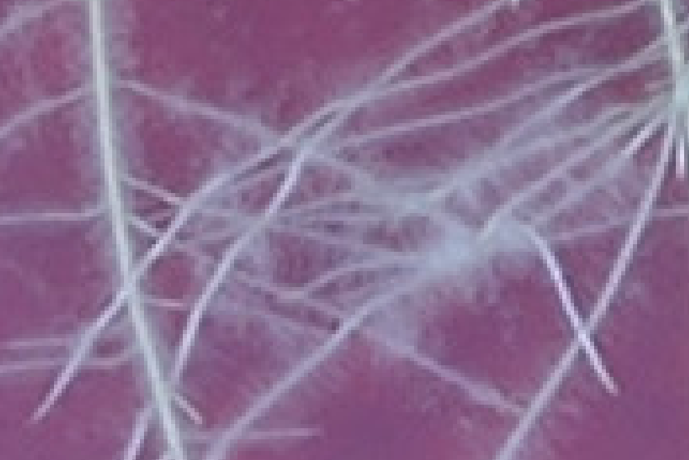 | 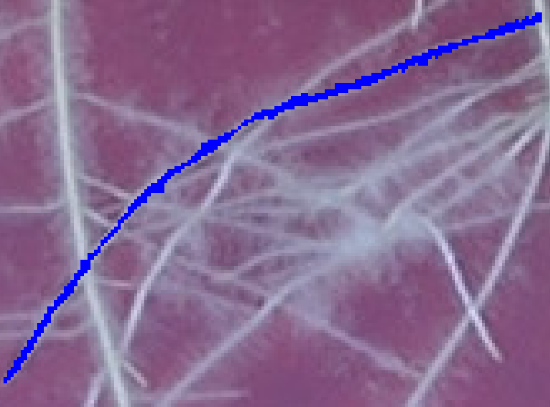 |

## Active training

Neural networks are the state of the art for most image processing tasks, but they cannot be used without training on high accuracy labeled data, and they are not currently capable of matching human level accuracy. This program uses active training to work around both problems.

```
  classical pipeline  ->  manual correction  ->  high accuracy labels
           ^                                              |
           |                                              v
   network takes over  <-   train U-Net   <-------  PackageTrainingData
   the first pass
```

Normally a network must be trained on a very large amount of labeled data and requires a lot of hyperparameter optimization, because it is intended to be used by itself and must be as close to perfect as possible. Active training lowers that bar by always intending for human oversight. The network becomes useful as soon as it becomes more accurate than the original program, which allows it to start working with very little training. It can then be retrained as more data becomes available. As it repeatedly improves it saves more time, and more labels become available faster.

The measurements support this. Twelve samples were enough to cut labeling time by more than half and raise the Dice coefficient from roughly .93 to roughly .98. All networks achieved higher validation scores and resisted overfitting as more samples were added, and the main dataset's network had lower validation loss than training loss for its entire run.

If a trained network is present it runs when the image is loaded. Pressing Enter accepts the prediction and moves directly to manual correction, and pressing N steps into the full pipeline instead.

### Network structure

The network is a convolutional U-Net with five encoding and decoding stages, so input images should have heights and widths divisible by 32 to maintain their dimensions. Each stage of the encoder is a dense convolutional block of three layers, followed by a max pooling layer and a batch normalization layer. A dense block contains skip connections from each layer's output to each subsequent layer's input, which are concatenated together for the block's final output. This allows the network to make multi layered computations without losing the intermediate steps, and allows the gradient to flow back more effectively.

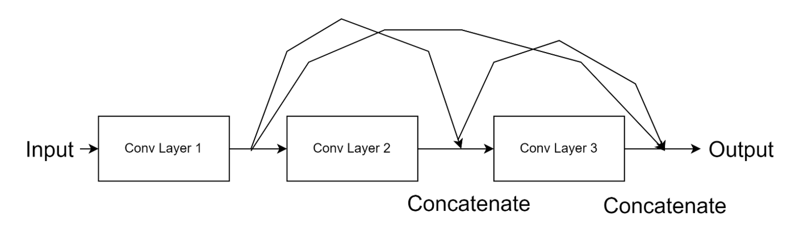

Each convolutional layer is followed by batch normalization and by dropout at 25%. The dropout zeroes a layer's entire output at once rather than individual activations, which forces the network to learn more redundant and general rules since it cannot rely on any particular connection. Dropout is not applied to the first layer, since that would potentially remove all input for future layers.

Between the encoder and decoder there are two convolutional layers, each followed by batch normalization. This section of the network is the most spatially compressed, so a convolution here sees more of the image than anywhere else. These layers take advantage of that by using a kernel size of 7x7 instead of the standard, which allows the network to take a large amount of global information into account.

Each stage of the decoder is a 2D convolutional transpose layer followed by a dense convolutional block. The transpose layer uses a 4x4 kernel, which is important to be a multiple of its 2x2 stride for numerical reasons. The output layer uses a 1x1 kernel with a sigmoid activation, where each value is the predicted probability of that pixel being a root.

The network uses a Dice loss function. This matters because most of the image is background, so the network could easily reach 95% simple accuracy just by never predicting any roots. Dice spreads the loss evenly when the network makes many mistakes, and heavily penalizes errors when the network is mostly correct.

Training is handled by [TrainNetwork.py](TrainNetwork.py), which runs on Colab against the archives produced by [PackageTrainingData.py](PackageTrainingData.py). The user must handle training on their own, as it requires far more computational resources than inference. A mid-range CPU can make a prediction in a few seconds, but doing a decent amount of training would take days at least.

## Implementation notes

The program is mainly written in Python, with several functions written in C++ for speed. Several stages also take advantage of parallelization, so a CPU with more cores will perform better. A top tier CPU is not required, and the program is reasonably responsive on a mid-range one.

It follows a model, view, controller split. [Model.py](Model.py) holds the twelve label layers and the image data and has no Qt dependency. [View.py](View.py) is passive and communicates through signals. [Controller.py](Controller.py) owns the stage machine. Undo and redo are implemented by deep copying the model after every state change.

The pixel level searches are far too slow in Python, and they do not vectorize, because each probe's next step depends on its own history. Each is a standalone shared library called through [cffi](https://cffi.readthedocs.io/), with NumPy arrays passed as raw pointers so nothing is copied.

| Kernel | Used by |
|---|---|
| [GaussianThreshold.cpp](C++/src/GaussianThreshold.cpp) | Gaussian filter |
| [EdgeFinder.cpp](C++/src/EdgeFinder.cpp) | Edge finder, parallelized |
| [ConnectionSearch.cpp](C++/src/ConnectionSearch.cpp) | Connect separated roots |
| [GetClosestSkeleton.cpp](C++/src/GetClosestSkeleton.cpp) | Delete segment |
| [GetClosestPointsToSegment.cpp](C++/src/GetClosestPointsToSegment.cpp) | Delete segment |
| [TwoPointConnection.cpp](C++/src/TwoPointConnection.cpp) | Add segment |

Several of these keep a pure Python reference implementation next to them, such as `getClosestSkeletonPy` and `getClosestPointsToSegmentPy`. They are far slower, but they are readable and useful for verifying the C++ against.

## Running it

This is research code from a 2024 master's project, published as a portfolio piece. It is not packaged for easy setup.

```bash
pip install -r requirements.txt
python Main.py <datasetDirectory>
```

On startup the program looks inside the image and label directories provided by the user. It sorts the list of image names and loads the first one that does not have a corresponding label, so running it repeatedly walks through the dataset.

There are a few rough edges to be aware of. The C++ kernels are built on startup by `compileCPP()` in [Main.py](Main.py), which shells out to `c++` and skips any library that already exists, so the first run needs a compiler on the path. All shared library paths are relative to the working directory, so the program must be launched from the repository root. [PackageTrainingData.py](PackageTrainingData.py) is run by hand between labeling and training. Finally, the trained network is not distributed in the repository, because the SavedModel is past GitHub's file size limit. Without it the program starts at the Gaussian filter stage and runs as a purely classical pipeline, which is the .93 Dice configuration.

A dataset directory is expected to look like this:

```
<datasetDirectory>/
  Images/           source images, provided by the user
  Labels/           .npz output, created automatically
  Training/         packaged training data
  TextureMatching/  user-provided texture examples
  Network/          trained SavedModel, if one exists
  Settings.ini      per-dataset settings
```

### Controls

| Input | Action |
|---|---|
| Mouse wheel, click and drag | Zoom, pan |
| Enter | Re-run the current stage with the current settings |
| N | Advance to the next stage, and save on the final stage |
| Z, Shift Z | Undo, redo |
| X | Toggle label visibility |

On the label cropping stage, left clicking places polygon points. Enter keeps what is inside the polygon, and Shift Enter keeps what is outside.

On the texture matching stage, left clicking saves a background example and right clicking saves a foreground example. Enter retrains the SVM and re-runs the stage.

On the manual correction stage, two left clicks add a segment between the two points, or a straight line if Shift is held. Right clicking deletes the segment under the cursor. Middle clicking deletes labels in a radius, which defaults to 5 pixels and becomes 20 with Shift, 100 with Ctrl, and 1 with Alt.

## Future work

There are a few areas where this project could be improved.

The most important is a better root smoothing tool or stage. Fuzzy roots often have strange offshoots that need to be removed, and removing them involves repeatedly using the radius delete tool along the length of the root at the proper spacing. If this could be done faster or automatically, it would probably make labeling take half as long.

Another area is root analysis. The program currently produces only a segmentation map and does not provide any direct analysis. This is relatively simple compared to segmentation, but it is a sorely lacking feature.

Finally, the root connection algorithm could be improved. It works decently well, but there are always many sections that it misses, and others that should not be connected.

The project also has no automated tests. The scratch scripts in the repository history were used for inspecting results during development and are not a test suite.

## Datasets and references

The two public datasets used in the evaluation are from [GigaDB](https://doi.org/10.5524/100651), published as supporting data for RootNav 2.0.

The full evaluation, literature survey, and algorithm descriptions are in:

> John Otters. *Development of High-Accuracy Root Phenotyping Software.* MS Computer Science project, California State Polytechnic University, Pomona, 2024. See [docs/paper.pdf](docs/paper.pdf).

The program was compared against RootNav and [saRIA](https://doi.org/10.1038/s41598-019-55876-3) by Narisetti et al. Both RootNav releases are covered in the paper: [RootNav](https://doi.org/10.1104/pp.113.221531) by Pound et al. and [RootNav 2.0](https://doi.org/10.1093/gigascience/giz123) by Yasrab et al.
